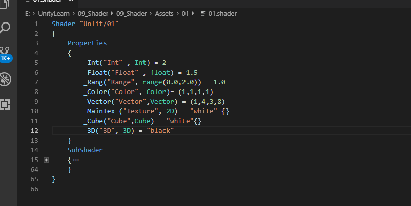

## 01 渲染流水

 

 **Cpu应用阶段：**
 

**几何阶段以及光栅化应用阶段：**
 

 **顶点着色器:**

 &ensp;顶点着色器的处理单位是顶点

 &ensp;主要工作：坐标变换以及逐顶点光照，输出后续阶段需要的数据

 &ensp;模型空间 -->齐次裁剪空间-->计算顶点颜色

 &ensp;0.vertex = UnityObjectToClipPos(v.vertex); //unity 2017及以上

**裁剪：**
 

**屏幕映射:**
 

 **三角形设置和三角形遍历：**

 **片元着色器与逐片元操作：**

 **模版测试和深度测试：**

 **合并混合：**

## 02 UnityShader

**shaderLab的基本类型：**

**1. 顶点片元shader:**

**2. sufrfaceShader:**

## 3 数学知识

**二维：**
